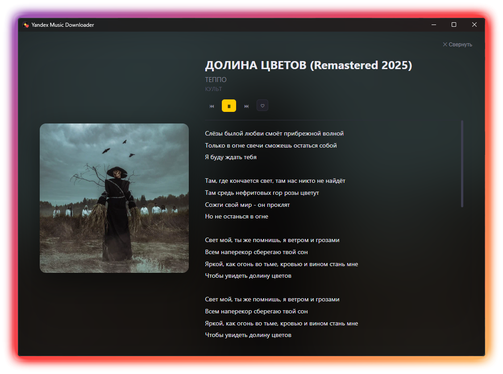

<p align="center">
  
</p>

<h1 align="center">Yandex Music Downloader GUI</h1>

<p align="center">
  <b>Графический интерфейс для скачивания музыки с Яндекс Музыки</b>
</p>

<p align="center">
  
  
  
</p>

---

<p align="center">
  
</p>

## ✨ Основные возможности

| Функция | Описание |
| :--- | :--- |
| **⬇️ Мульти-скачивание** | Загрузка плейлистов, альбомов, отдельных треков и всех дискографий артистов. |
| **⚡ Высокая скорость** | Параллельная загрузка до 8 треков одновременно (количество потоков настраивается). |
| **▶️ Встроенный плеер** | Предпросмотр и прослушивание треков перед скачиванием прямо в приложении. |
| **📋 Личный кабинет** | Быстрый доступ к вашим плейлистам и добавление всей медиатеки в очередь в 1 клик. |
| **📁 Локальная медиатека** | Просмотр и воспроизведение уже скачанных файлов без сторонних плееров. |
| **🔑 Безопасный вход** | Удобная авторизация через **OAuth Device Flow** без ручного копирования токенов. |

---

## 🔗 Поддерживаемые ссылки

Приложение автоматически очищает ссылки от `utm`-меток и лишних параметров:

* **Альбом:** `https://music.yandex.ru/album/12345`
* **Трек:** `https://music.yandex.ru/album/12345/track/67890`
* **Плейлист:** `https://music.yandex.ru/users/username/playlists/3`
* **Короткая ссылка:** `https://music.yandex.ru/playlists/lk.UUID`
* **Исполнитель:** `https://music.yandex.ru/artist/11111`

---

## 🚀 Быстрый старт

### Требования

Перед началом убедитесь, что у вас установлен **Python 3.9** или выше.

### Установка зависимостей

```bash
# Установка библиотек проекта
pip install pywebview yandex-music pystray Pillow

# Установка консольного загрузчика
pip install yandex-music-downloader
# Или через pipx (рекомендуется):
pipx install yandex-music-downloader
```

---

## 🧩 Зависимости

**Скачивание файлов** выполняется консольным [yandex-music-downloader](https://github.com/llistochek/yandex-music-downloader) (llistochek) — его нужно установить отдельно, как выше.

Каталог Яндекс.Музыки (поиск, плейлисты, плеер, метаданные) работает через библиотеку [yandex-music](https://github.com/MarshalX/yandex-music-api) (MarshalX).
